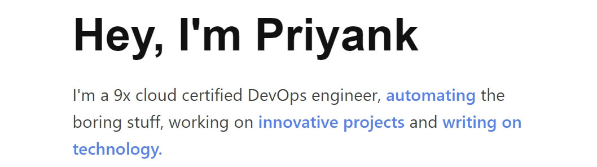
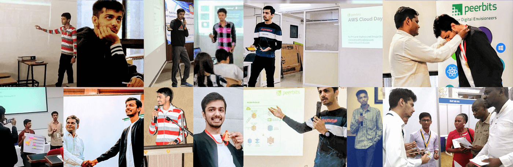

### ☁ Certified DevOps Engineer | 4x OCI | 4x Alibaba | 3x Udacity Scholar | 3x IBM | 2x Fortinet | 1x Cisco | AviatrixACE, ICSI Certified | AWS | K8s | Linux | Automation Ninja | Securing World 🛡🌎

Welcome to my code palace. I'm [Priyank](https://priyankvaghela.com/ "priyankvaghela.com"), a 22-year self-taught programmer and a DevOps engineer with 2+ years of experience in cloud technologies, especially in AWS. I'm a highly passionate individual and love to work on cloud & automation.

I love to create [innovative projects](https://priyankvaghela.com/projects "priyankvaghela.com"), [write about things](https://www.quora.com/profile/Priyank-Vaghela-2 "www.quora.com") I do & actively contributing to the field as a speaker. Also, I collaborate effectively & I'm always super excited to learn new things.

Apart from being a forever student, I'm a nature-lover; travelling and photography are my hobbies.

> #### I also maintain a Quora Space for AWS enthusiasts: [☁️ Everything AWS Cloud](https://www.quora.com/q/awscloud "www.quora.com")

#### Let's connect & make the most out of it! 💥
 💼 LinkedIn - [priyank-vaghela](https://www.linkedin.com/in/priyank-vaghela)\
 🖼 Instagram - [priyankvaghela_](https://instagram.com/priyankvaghela_ "instagram.com")\
 💬 Twitter - [PriyankVaghela_](https://twitter.com/PriyankVaghela_ "twitter.com")\
 ✍ Quora - [Priyank-Vaghela-2](https://www.quora.com/profile/Priyank-Vaghela-2 "quora.com")\
 🌐 Website - [https://priyankvaghela.com](https://priyankvaghela.com/ "priyankvaghela.com")\
 💡 Some of my ideas into reality - [Projects](https://priyankvaghela.com/projects "priyankvaghela.com")

Best wishes to you! :)\
- [Priyank Vaghela](https://priyankvaghela.com)
