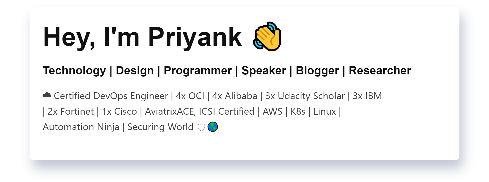

### ⚡ I'm a [13x cloud certified](https://priyankvaghela.com/categories/certification) DevOps engineer, [automating](https://priyankvaghela.com/automation) the boring stuff, working on [innovative projects](https://priyankvaghela.com/projects) and [writing on technology.](https://priyankvaghela.com/blog)

### 👀 Find more about Me

  

### 🤝🏻 Connect with Me

   

### 🎖 Certifications
1.  [AWS Certified Solutions Architect – Associate](https://priyankvaghela.com/certification/being-aws-certified-solutions-architect-associate/)
2.  [AWS Certified Cloud Practitioner](https://priyankvaghela.com/certification/being-aws-certified-cloud-practitioner/)
3.  [Microsoft Certified: Azure Fundamentals](https://priyankvaghela.com/certification/microsoft-certified-azure-fundamentals/)
4.  [Microsoft Certified: Azure Data Fundamentals](https://priyankvaghela.com/certification/microsoft-certified-azure-data-fundamentals/)
5.  [Microsoft Certified: Azure AI Fundamentals](https://priyankvaghela.com/certification/microsoft-certified-azure-ai-fundamentals/)
6.  [Oracle Cloud Infrastructure Foundations 2020 Certified Associate](https://www.linkedin.com/posts/priyank-vaghela_oracle-cloud-infrastructure-foundations-2020-activity-6693409658364825602-xZC3)
7.  [Oracle Autonomous Database Cloud 2019 Certified Specialist](https://www.linkedin.com/posts/priyank-vaghela_oracle-autonomous-database-cloud-2019-certified-activity-6696060645219045376-4XFO)
8.  [Oracle Cloud Infrastructure 2019 Cloud Operations Certified Associate](https://www.linkedin.com/posts/priyank-vaghela_oracle-cloud-infrastructure-2019-cloud-operations-activity-6707139464906448896-QGYF)
9.  [Oracle Cloud Infrastructure Developer 2020 Certified Associate](https://www.linkedin.com/posts/priyank-vaghela_oracle-cloud-infrastructure-developer-2020-activity-6703308836062687232-_OdW)
10.  [Gremlin Certified Chaos Engineering Practitioner (GCCEP)](https://priyankvaghela.com/certification/gremlin-certified-chaos-engineering-practitioner/)
11.  [Alibaba Cloud Associate - Cloud Computing Certification](https://priyankvaghela.com/certification/being-alibaba-cloud-associate-cloud-computing-certified/)
12.  [Alibaba Cloud Associate - Cloud Security Certification](https://priyankvaghela.com/certification/being-alibaba-cloud-associate-cloud-security-certified/)
13.  [Alibaba Cloud Associate - Big Data Certification](https://priyankvaghela.com/certification/being-alibaba-cloud-associate-big-data-certified/)
14.  [Alibaba Cloud Associate - Cloud-Native Certification](https://priyankvaghela.com/certification/being-alibaba-cloud-associate-cloud-native-certified/)
15.  [Google IT Support Professional Certificate](https://priyankvaghela.com/certification/google-it-support-professional-certificate/)
16.  [Aviatrix Certified Engineer - Multi-Cloud Network Associate](https://www.linkedin.com/posts/priyank-vaghela_aviatrix-certified-multi-cloud-networking-activity-6690263339299295232-oeur)
17.  [Udacity Cloud DevOps Engineer Nanodegree](https://priyankvaghela.com/certification/udacity-cloud-devops-engineer-nanodegree/)
18.  [Udacity AWS Cloud Architect Nanodegree](https://priyankvaghela.com/certification/udacity-aws-cloud-architect-nanodegree/)

#### [Source: Credly](https://www.credly.com/users/priyank-vaghela/badges)

<h3>I also maintain a Quora Space for AWS enthusiasts: </h3>

[- Priyank Vaghela](https://priyankvaghela.com)
