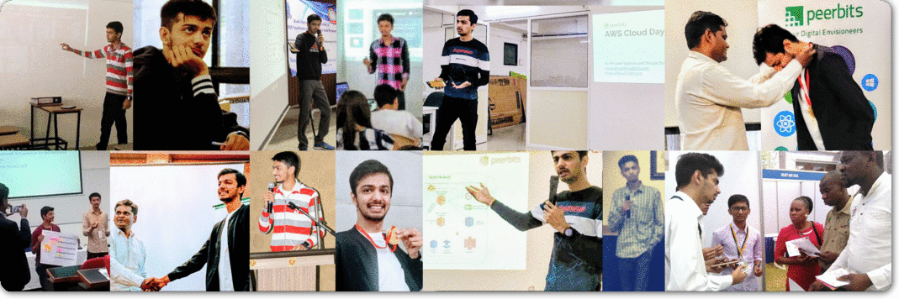

⚡ Hi, I'm Priyank Vaghela, a DevOps Engineer ☁.
---

## Welcome to my code palace!

> ### Certifications source: https://www.youracclaim.com/users/priyank-vaghela/badges

> #### I also maintain a Quora Space for AWS enthusiasts: [☁️ Everything AWS Cloud](https://www.quora.com/q/awscloud "www.quora.com")

### Let's connect & make the most out of it! 💥
- 💼 LinkedIn - [priyank-vaghela](https://www.linkedin.com/in/priyank-vaghela)
- 🏅 Credly - [Badge Collection](https://www.youracclaim.com/users/priyank-vaghela/badges)
- 🖼 Instagram - [priyankvaghela_](https://instagram.com/priyankvaghela_ "instagram.com")
- 💬 Twitter - [PriyankVaghela_](https://twitter.com/PriyankVaghela_ "twitter.com")
- ✍ Quora - [Priyank-Vaghela-2](https://www.quora.com/profile/Priyank-Vaghela-2 "quora.com")
- 🌐 Website - [https://priyankvaghela.com](https://priyankvaghela.com/ "priyankvaghela.com")
- 💡 Some of my ideas into reality - [Projects](https://priyankvaghela.com/projects "priyankvaghela.com")

[Priyank Vaghela](https://priyankvaghela.com)
